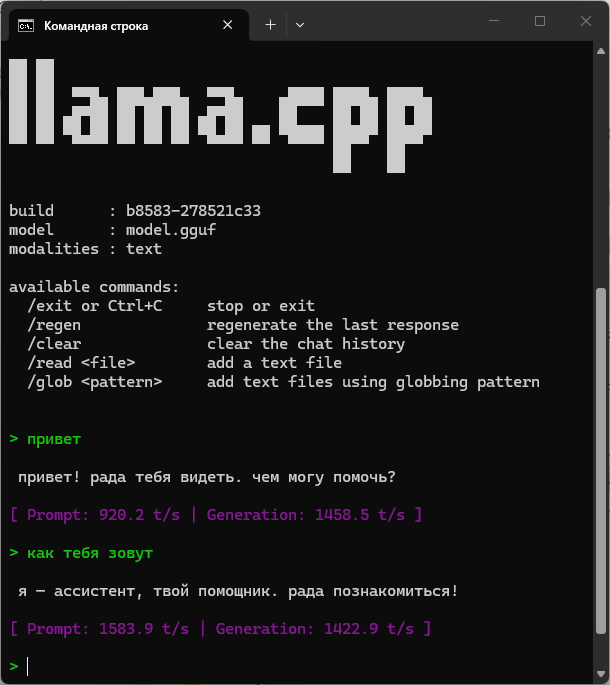
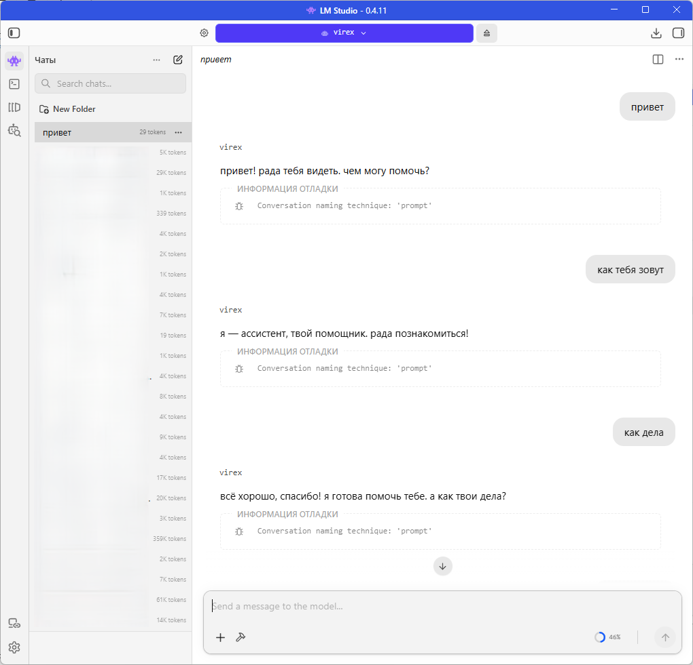

# LLMGPT2: ультра-компактная реализация GPT-2 на C# с OpenCL и экспортом в GGUF

Реализация на C# для создания и обучения сверхмалых моделей в стиле GPT-2 с нуля, с ускорением через OpenCL (ILGPU). Основная цель — получить максимально эффективные модели, которые можно экспортировать в формат **GGUF** для инференса в `llama.cpp`, LM Studio и других современных рантаймах LLM.

Итоговая экспортированная GGUF-модель занимает всего **~440 КБ**, что делает её подходящей для очень ограниченных сред.

<details>
  <summary>Нажми, чтобы увидеть картинку</summary>

  

  
</details>

## Возможности

- **100% C#**: определение модели, цикл обучения и экспортёр GGUF полностью написаны на C# с использованием ILGPU.
- **Ускорение OpenCL**: обучение на GPU через OpenCL-бэкенд ILGPU.
- **Экспорт в GGUF**: нативный экспорт в формат GGUF v3 для максимальной совместимости.
- **Ультралёгкая**: итоговая модель ~440 КБ, ~104K параметров.
- **Одноходовый (stateless) чат**: укороченный чат-шаблон предотвращает накопление контекста, делая поведение предсказуемым.

## Архитектура модели

Стандартный decoder-only трансформер GPT-2 с минимальным числом параметров.

### Параметры модели

| Параметр | Значение | Описание |
| :--- | :--- | :--- |
| `n_params` | ~104K | Общее число обучаемых параметров |
| `n_vocab` | 512 | Размер BPE-словаря |
| `n_ctx` | 63 | Максимальная длина контекста (автоадаптация по данным) |
| `n_embd` | 64 | Размерность эмбеддингов |
| `n_head` | 2 | Число голов внимания |
| `n_layer` | 1 | Число трансформер-блоков |
| `head_dim` | 32 | Размерность на голову (`n_embd / n_head`) |
| `ffn_dim` | 128 | Скрытая размерность FFN |

**Разбиение по параметрам:**
- Эмбеддинги токенов: 32,768  (`512 × 64`)
- Позиционные эмбеддинги: 4,032  (`63 × 64`)
- Трансформер-блок (1×): 33,472
  - Внимание (Q/K/V + Wo): 16,640
  - Два LayerNorm: 256
  - FFN (GELU, два линейных слоя): 16,576
- Финальный LayerNorm: 128
- Проекция LM head: 33,280  (`64 × 512 + 512`)
- **Итого: 103,680 параметров**

### Структура слоёв (последовательно)

```
Input IDs
  ↓
Token Embedding (wte)           [vocab=512, dim=64]
  ↓
+ Positional Embedding (wpe)    [seq_len=63, dim=64]  ← learnable + sinusoidal
  ↓
×1 × TransformerBlockPreNorm
  ├─ LayerNorm 1 (attn_norm)    [dim=64]
  ├─ MultiHeadAttention         [qkv fused, 2 heads, causal mask]
  ├─ Residual Add
  ├─ LayerNorm 2 (ffn_norm)     [dim=64]
   ├─ FeedForward (GELU)         [64 → 128 → 64]
  └─ Residual Add
  ↓
Final LayerNorm (ln_f)          [dim=64]
  ↓
Linear LM Head (lm_head)        [64 → 512]
  ↓
Logits → Softmax → Token
```

### Состав трансформер-блока (Pre-Norm)

Модель содержит **один** трансформер-блок с архитектурой **Pre-LayerNorm**:

```
x ──┐
    │
    ├─→ LayerNorm(x) ─→ MultiHeadAttention(Q,K,V) ──┐
    │                                              │
    └──────────────────────+───────────────────────┘
                           │
                           v
                     x + attention_output
                           │
                           ├─→ LayerNorm ─→ GELU(Linear_up) ─→ Linear_down
                           │
                           └──────────────────────+───────────────┘
                                                  │
                                                  v
                                            x + ffn_output
```

### Состав трансформер-блока (Pre-Norm)

Модель содержит **один** трансформер-блок с архитектурой **Pre-LayerNorm**:

```



<user> {{ message['content'] }}<assistant>


```

**Формат во время выполнения:**
```
<user> {user_input}<assistant>
```


Предыдущие ходы не включаются в контекстное окно. Это обеспечивает:
- отсутствие памяти о прошлых взаимодействиях
- строго одноходовое следование инструкции
- предсказуемое поведение независимо от истории
- предотвращение «загрязнения» контекста в длинных диалогах

Используемые спецтокены:

| Токен | ID | Роль |
| :--- | :--- | :--- |
| `<pad>` | 0 | Паддинг |
| `<unk>` | 1 | Неизвестный токен |
| `<s>` | 2 | BOS (добавляется токенизатором) |
| `</s>` | 3 | EOS (добавляется в обучающие данные) |
| `<user>` | 4 | Маркер хода пользователя |
| `<assistant>` | 5 | Начало ответа ассистента |
| `<sep>` | 6 | Разделитель (не используется) |

## Токенизация

- **Алгоритм:** Byte-Pair Encoding (BPE)
- **Предтокенизация:** regex GPT-2 с учётом специальных токенов
- **Отображение байтов:** GPT-2 `bytes_to_unicode()` для полного покрытия UTF-8
- **Начальный словарь:** спецтокены (7) + 256 байтовых токенов = 263 базовых токена
- **Слияния (merges):** обучаются инкрементально на корпусе
- **Итоговый словарь:** 512 токенов (кастомный BPE для диалогов)

Тренер BPE принудительно делает спецтокены атомарными единицами, не позволяя разбивать их при кодировании.

## Экспорт в GGUF

`GgufExporter` формирует полностью совместимый файл **GGUF v3**:

- **Архитектура:** `gpt2`
- **Длина контекста:** 63 токена (автоадаптация: 95-й перцентиль по корпусу + округление)
- **Формат тензоров:** FP32 (все тензоры — 32-битные float)
- **Словарь:** стандартный GPT-2 byte-level BPE + кастомные спецтокены
- **Метаданные:** включают чат-шаблон, ID токенов, merges и scores
- **Переназначение тензоров:** словарь переупорядочивается под стандарт GPT-2 (спецтокены 0–6, затем байтовые токены в каноническом порядке, затем merges)
- **Позиционные эмбеддинги:** синусоидальные + обучаемые объединяются (суммируются) и сохраняются как `position_embd.weight`
- **Квантование отсутствует:** полная точность (модель и так крошечная)

**Экспортируемые тензоры:**
```
token_embd.weight          [64, 512]
position_embd.weight       [64, 63]

blk.0.attn_norm.weight     [64]
blk.0.attn_norm.bias       [64]
blk.0.attn_qkv.weight      [64, 192]   (Q/K/V fused, transposed)
blk.0.attn_qkv.bias        [192]
blk.0.attn_output.weight   [64, 64]    (Wo)
blk.0.attn_output.bias     [64]
blk.0.ffn_norm.weight      [64]
blk.0.ffn_norm.bias        [64]
blk.0.ffn_up.weight        [64, 128]   (W1)
blk.0.ffn_up.bias          [128]
blk.0.ffn_down.weight      [128, 64]   (W2)
blk.0.ffn_down.bias        [64]

output_norm.weight         [64]
output_norm.bias           [64]
output.weight              [64, 512]   (lm_head, transposed)
output.bias                [512]
```


**Итоговый размер файла:** ~440 КБ (103,680 параметров × 4 байта × накладные расходы ~6%).

## Технический стек

| Компонент | Технология |
| :--- | :--- |
| Язык | C# 12 / .NET 8 |
| GPU-бэкенд | ILGPU 1.5.3 (OpenCL) |
| Вычисления | ILGPU.Algorithms |
| Токенизатор | кастомный BPE (совместим с GPT-2) |
| Формат экспорта | GGUF v3 |
| Целевые рантаймы | llama.cpp, LM Studio, Ollama (через конвертацию) |

## Структура проекта

```
LLMGPT2/
├── src/
│   ├── GPT2/
│   │   ├── LLMGPT2.cs           # Main model class (train + inference)
│   │   └── GgufExporter.cs      # GGUF v3 exporter
│   ├── Layers/
│   │   ├── EmbeddingLayer.cs
│   │   ├── PositionalEmbeddingLayer.cs  (learnable + sinusoidal)
│   │   ├── TransformerBlockPreNorm.cs   # Pre-Norm block
│   │   ├── MultiHeadAttentionLayer.cs   # Causal attention
│   │   ├── LayerNormLayer.cs
│   │   ├── GELUFeedForwardLayer.cs      # MLP with GELU
│   │   ├── LinearLayer.cs
│   │   └── LayerWeights.cs
│   ├── Tokenizers/
│   │   ├── BPETokenizer.cs      # GPT-2 style BPE
│   │   └── ITokenizer.cs
│   ├── ModelProfile.cs          # Auto-config + corpus analyzer
│   ├── Vocab.cs                 # Token ↔ ID mapping
│   ├── Context.cs               # ILGPU context wrapper
│   ├── DatasetLoader.cs         # JSON/CSV loader
│   ├── Adam.cs                  # Adam optimizer
│   ├── LossManager.cs           # Cross-entropy + softmax
│   └── MatrixOps.cs             # GPU kernels (softmax, clip, etc.)
├── Program.cs                   # Interactive CLI
├── data/
│   ├── pretraining_data.json   # 24 sentences
│   └── chat_training_data.json # 54 Q&A pairs
├── LLMGPT2.csproj              # ILGPU packages
└── README.md                   # This file
```


## Быстрый старт

### Требования

- **.NET 8 SDK** или новее
- **GPU с поддержкой OpenCL 1.2+** (AMD, Intel, NVIDIA)
- Windows 10/11, Linux или macOS

### Сборка и запуск

```bash
# Перейдите в папку проекта
cd LLMGPT2

# Восстановление пакетов
dotnet restore

# Сборка
dotnet build --configuration Release

# Запуск интерактивного CLI
dotnet run --project LLMGPT2.csproj
```

### Процесс обучения

1. **Создать новую модель** → BPE-токенизатор обучается на вашем датасете
2. **Выбрать фазы обучения** → pretrain, finetune или обе
3. **Обучение** → модель учится на корпусе (гиперпараметры автонастраиваются)
4. **Экспорт в GGUF** → `model.gguf` готов для `llama.cpp`

## Инференс с GGUF

### Через `llama.cpp` (CLI)

```bash
llama-cli -m model.gguf -c 2048
```

### Через LM Studio

1. Перетащите model.gguf в папку моделей LM Studio
2. Выберите модель
3. Начните чат — он будет строго одноходовым (без «памяти»)


## Как это работает

### Прямой проход (Forward, GPU)

1. **ID токенов** → `EmbeddingLayer` (lookup) → `[seq_len, emb_dim]`
2. Добавление **синусоидальных + обучаемых** позиционных кодировок
3. Для каждого трансформер-блока:
   - **Attention:** Q,K,V = Linear(x) → разбиение по головам → каузальное внимание (Q·K/√d → softmax → attn·V) → Wo
   - **Residual** (x + attn_out)
   - **FFN:** LayerNorm → Linear → GELU → Linear
   - **Residual** (x + ffn_out)
4. **Финальный LayerNorm**
5. **Linear** → логиты по словарю

### Обратный проход (Backward, GPU)

1. Cross-entropy loss (neg log-likelihood)
2. Backprop через LM head (softmax + градиент линейного слоя)
3. В обратном порядке через блоки:
   - накопление градиентов от residual-ветвей
   - backward через FFN (W2 → GELU → W1)
   - backward через attention (Wo → softmax → QKV)
4. Обновление весов оптимизатором **Adam**
5. Gradient clipping (max norm = 2.0–5.0 в зависимости от размера датасета)

### Поток экспорта GGUF

1. **Вывод конфига** по списку слоёв (число блоков, размеры)
2. **Пересборка стандартного GPT-2 словаря** с remapping:
   - ID 0–6: спецтокены (`<pad>`, `<unk>`, `<s>`, `</s>`, `<user>`, `<assistant>`, `<sep>`)
   - ID 7–262: 256 байтовых токенов в порядке GPT-2 `bytes_to_unicode()`
   - ID 263+: BPE merges (с сохранением ранга merge как score)
3. **Сбор всех тензоров** из GPU-буферов:
   - транспонирование матриц весов из `[in, out]` в `[out, in]` под column-major layout GGML
   - переупорядочивание строк словаря в `token_embd.weight` и `output.weight` по remapping old→new ID
   - «вплавление» синусоидальных позиций в обучаемые позиционные эмбеддинги
4. **Запись файла** за один проход:
   - заголовок (24 байта)
   - KV-метаданные (включая чат-шаблон)
   - массив описаний тензоров
   - padding до выравнивания 32 байта
   - массивы данных тензоров (каждый выровнен на 32 байта)

Временные файлы не используются — запись идёт потоково на диск.

## Заметки по производительности

- **Память:** ~3× от числа параметров во время обучения (веса + градиенты + моменты Adam)
  - 104K параметров × 4 байта × 3 ≈ **1.2 МБ** GPU-памяти (без учёта буферов)
- **Скорость обучения:** ~50–200 токенов/сек на встроенных GPU (зависит от длины последовательности)
- **Скорость инференса:** ~15–50 токенов/сек на CPU (через llama.cpp)
- **Batch size:** 1 (батчинг не реализован — online обучение)
- **Пропускная способность:** ограничена копированием данных CPU↔GPU на каждом шаге

## Ссылки

- [Оригинальная статья GPT-2](https://cdn.openai.com/better-language-models/language_models_are_unsupervised_multitask_learners.pdf)
- [Спецификация GGUF](https://github.com/ggerganov/ggml/blob/master/docs/gguf.md)
- [Документация ILGPU](https://ilgpu.net/docs/)
- [llama.cpp](https://github.com/ggerganov/llama.cpp/)

## Лицензия

MIT